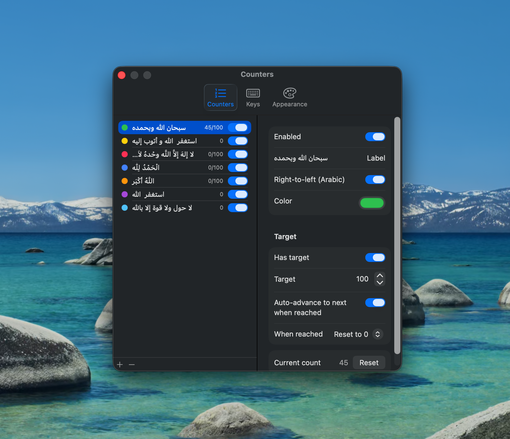
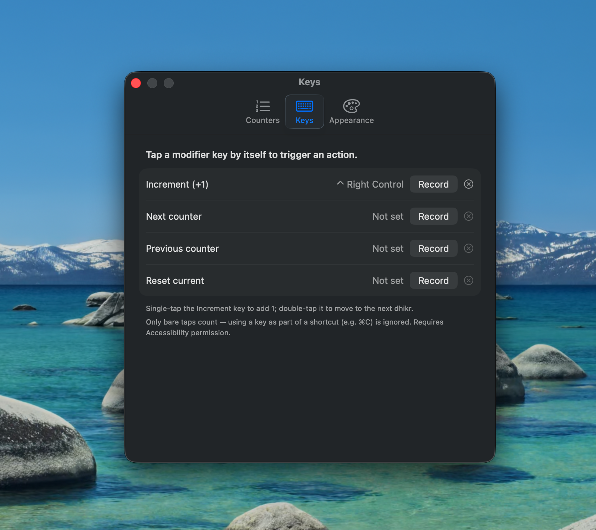
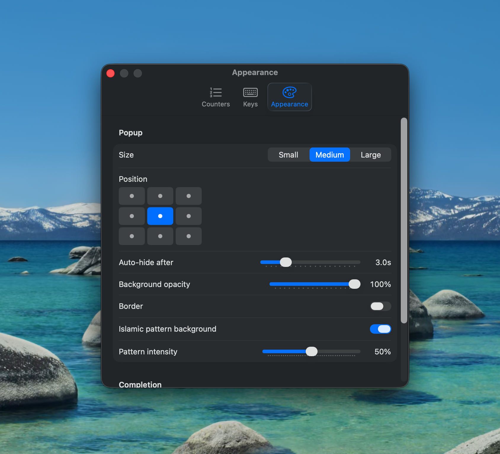

<p align="center">
  
</p>

# Adwam Tally

A tiny menu-bar tally counter for macOS, built for dhikr (tasbih) counting.
Tap a modifier key anywhere and a small floating popup shows the count ticking
up; tap another key to switch to the next dhikr. Counters can have targets
(33/99/…) that auto-advance, and everything is configurable from the menu bar.

Requires macOS 14+.

<p align="center">
  
</p>

## Install

### Homebrew

```bash
brew tap aminehmida/tap
brew install --cask adwamtally
```

### Direct download

Grab `AdwamTally.zip` from the
[latest release](https://github.com/aminehmida/AdwamTally/releases/latest),
unzip, and move `AdwamTally.app` to `/Applications` (or `~/Applications`).

The app is self-signed, not notarized. If macOS refuses to open it
("can't be opened" / "damaged"), either right-click the app ▸ **Open**, or run:

```bash
xattr -d com.apple.quarantine /Applications/AdwamTally.app
```

## Build from source

Needs the Xcode Command Line Tools (`xcode-select --install`) — full Xcode not
required.

```bash
./build-app.sh                     # builds and installs ~/Applications/AdwamTally.app
open ~/Applications/AdwamTally.app
```

The app lives in the **menu bar** (no Dock icon). The menu shows the current
dhikr and count, a list to switch, Reset Current / Reset All, Settings…, and
Quit.

You can also open it in Xcode later (if installed) with `open Package.swift`.

## First launch — grant Accessibility

The global modifier-key taps require Accessibility permission (macOS gates all
system-wide keyboard monitoring). On first run the app asks for it:

1. System Settings ▸ Privacy & Security ▸ **Accessibility**
2. Enable **AdwamTally** (add it with `+` and pick
   `~/Applications/AdwamTally.app` if it isn't listed).

The keys start working immediately after you toggle it on — no relaunch needed.

## Counters

**Settings ▸ Counters** — add/remove/reorder, and per counter set:

- **Label** (Arabic/RTL supported), **Color**
- **Target** (optional). With a target you also choose:
  - **Auto-advance** — jump to the next dhikr when the target is hit.
  - **When reached** — *Reset to 0* (fresh round) or *Keep counting* (climb past).
- Counters without a target just count up indefinitely.

<p align="center">
  
</p>

## Default keys

| Key           | Action              |
|---------------|---------------------|
| **Right Control** | +1 to current dhikr |
| **Left Command**  | switch to next dhikr |

**Tip:** you can also **double-tap** the +1 key to advance to the next dhikr,
without binding a separate key.

Rebind these (or add Previous / Reset Current) in **Settings ▸ Keys** — click
Record, then tap the modifier you want. Any left/right Shift, Control, Option,
or Command works. Only *bare* taps count; using a key as part of a real shortcut
(e.g. ⌘C) is ignored.

<p align="center">
  
</p>

## Appearance

**Settings ▸ Appearance** — popup **size** (S/M/L), **position** (9-spot grid),
**auto-hide** delay, and an optional **chime** when a target is reached (off by
default). The popup appears on the screen under the mouse.

<p align="center">
  
</p>

## State

Counts and settings persist to
`~/Library/Application Support/AdwamTally/state.json` and resume on relaunch.

## Notes

- Ad-hoc code signing is used. If a rebuild ever makes the keys stop working,
  re-check the Accessibility toggle (re-signing can reset the grant); the stable
  install path in `~/Applications` minimizes this.
